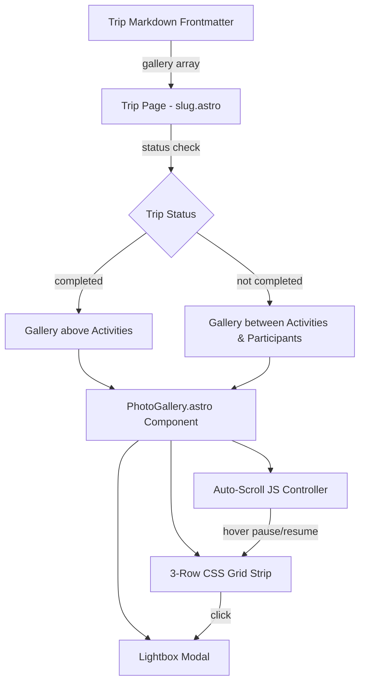

# Design Document: Photo Gallery

## Overview

This design adds a photo gallery feature to each trip page. The gallery is a horizontally auto-scrolling strip of photos arranged in 3 rows, using a CSS grid layout that accommodates both portrait and landscape orientations. The existing `TripGallery.astro` component will be replaced with a new implementation that supports auto-scrolling, conditional placement based on trip status, and an enhanced lightbox with date/location metadata.

The gallery data model extends the existing `TripGalleryItem` interface with optional `date` and `location` fields. No new dependencies are required — the implementation uses native CSS Grid, CSS animations, and vanilla JavaScript.

## Architecture

The feature modifies the existing trip page rendering pipeline:



The key architectural decisions:

1. **Single component**: `PhotoGallery.astro` handles the grid layout, auto-scroll behavior, and lightbox — keeping everything self-contained.
2. **Conditional slot placement**: The `[slug].astro` page template uses the trip `status` field to render the gallery in the correct slot. `TripLayout.astro` is updated with two gallery slots: `gallery-above-activities` and `gallery-between-activities-participants`.
3. **CSS-driven auto-scroll**: Uses `@keyframes` animation on a duplicated strip of photos for seamless looping, paused via `:hover`. This avoids requestAnimationFrame complexity and is GPU-accelerated.
4. **No new dependencies**: The implementation uses Astro's built-in `<Image>` component for optimization, CSS Grid for layout, and vanilla JS for the lightbox.

## Components and Interfaces

### Modified Components

#### `TripLayout.astro`
- Add two named slots for gallery placement:
  - `gallery-above-activities`: rendered before the Activities section
  - `gallery-between-activities-participants`: rendered between Activities and Participants sections
- Only one slot will receive content per page, determined by trip status in `[slug].astro`.

#### `src/pages/trips/[slug].astro`
- Import the new `PhotoGallery` component (replacing `TripGallery`).
- Conditionally render the gallery into the appropriate slot based on `data.status`:
  ```astro
  {data.status === 'completed' ? (
    <PhotoGallery slot="gallery-above-activities" gallery={data.gallery} tripTitle={data.title} />
  ) : (
    <PhotoGallery slot="gallery-between-activities-participants" gallery={data.gallery} tripTitle={data.title} />
  )}
  ```
- Only render the gallery if `data.gallery && data.gallery.length > 0`.

### New Components

#### `PhotoGallery.astro`

**Props:**
```typescript
interface Props {
  gallery: TripGalleryItem[];
  tripTitle: string;
}
```

**Structure:**
- Outer container with `overflow: hidden` and hover event listeners.
- Inner scrolling track: a flex container holding two copies of the photo grid (for seamless looping).
- Each copy is a CSS Grid with `grid-template-rows: repeat(3, 1fr)` and `grid-auto-flow: column` with `grid-auto-columns` sized to thumbnail width.
- Portrait images get `grid-row: span 3` (full height). Landscape images get `grid-row: span 1` (one row each, two can stack).
- The orientation (portrait vs landscape) is determined by an `orientation` field on each gallery item, or defaults to `landscape`.
- CSS `@keyframes` animation translates the track horizontally. The animation is paused on `:hover`.
- Each thumbnail is a clickable button that opens the lightbox.

**Lightbox:**
- Full-screen fixed overlay with dark backdrop.
- Displays the selected image, plus date, location, and description metadata.
- Navigation via prev/next buttons and arrow keys.
- Close via button, Escape key, or clicking the backdrop.
- Traps focus within the modal when open.
- Prevents body scroll when open.

### Modified Types

#### `src/types/trip.ts` — `TripGalleryItem`
```typescript
export interface TripGalleryItem {
  image: string;
  title?: string;
  description?: string;
  date?: string;       // new — e.g. "2026-01-21"
  location?: string;   // new — e.g. "Paris, France"
  orientation?: 'portrait' | 'landscape'; // new — defaults to 'landscape'
}
```

## Data Models

### Gallery Frontmatter Schema

Each trip markdown file's `gallery` array entries follow this shape:

```yaml
gallery:
  - image: "/images/trips/recap-2026/events/paris.jpg"
    title: "Paris Meetup"
    description: "AWS User Group Paris re:Cap event"
    date: "2026-01-21"
    location: "Paris, France"
    orientation: "landscape"
  - image: "/images/trips/recap-2026/portrait-shot.jpg"
    title: "Team Photo"
    date: "2026-01-22"
    location: "Lille, France"
    orientation: "portrait"
```

| Field         | Type     | Required | Default       | Description                              |
|---------------|----------|----------|---------------|------------------------------------------|
| `image`       | string   | Yes      | —             | Path to the image file                   |
| `title`       | string   | No       | —             | Display title for the photo              |
| `description` | string   | No       | —             | Description shown in lightbox            |
| `date`        | string   | No       | —             | Date the photo was taken (ISO format)    |
| `location`    | string   | No       | —             | Location where the photo was taken       |
| `orientation` | string   | No       | `"landscape"` | `"portrait"` or `"landscape"` for layout |

### CSS Grid Layout Model

The 3-row grid uses the following layout logic:

```
┌──────────┬──────────┬──────────────────┬──────────┐
│ landscape│ landscape│                  │ landscape│  Row 1
├──────────┤──────────┤    portrait      ├──────────┤
│ landscape│ landscape│   (spans 3)      │ landscape│  Row 2
├──────────┤──────────┤                  ├──────────┤
│ landscape│ landscape│                  │ landscape│  Row 3
└──────────┴──────────┴──────────────────┴──────────┘
```

- Row height: approximately 120px each (360px total gallery height on desktop).
- Landscape thumbnails: ~200px wide × ~120px tall.
- Portrait thumbnails: ~200px wide × ~360px tall (spanning all 3 rows).
- Gap: 8px between items.


## Correctness Properties

*A property is a characteristic or behavior that should hold true across all valid executions of a system — essentially, a formal statement about what the system should do. Properties serve as the bridge between human-readable specifications and machine-verifiable correctness guarantees.*

### Property 1: Gallery item count matches input

*For any* array of gallery items of length N (where N > 0), the rendered Photo_Gallery SHALL contain exactly N clickable thumbnail elements.

**Validates: Requirements 1.2**

### Property 2: Gallery placement matches trip status

*For any* trip, if the trip status is "completed" then the gallery SHALL be rendered in the `gallery-above-activities` slot, and if the trip status is not "completed" then the gallery SHALL be rendered in the `gallery-between-activities-participants` slot.

**Validates: Requirements 4.1, 4.2**

### Property 3: Lightbox displays correct image for clicked item

*For any* gallery with N items and any index i in [0, N), clicking the thumbnail at index i SHALL open the lightbox displaying the image from gallery item i.

**Validates: Requirements 5.1**

### Property 4: Lightbox displays all available metadata

*For any* gallery item that has a date, location, or description field, when that item is displayed in the lightbox, all of its available metadata fields SHALL be visible in the lightbox content.

**Validates: Requirements 5.2, 5.3, 5.4**

### Property 5: Lightbox navigation cycles through items

*For any* gallery with N items (N > 1) and any current index i, navigating "next" SHALL display the item at index (i + 1) mod N, and navigating "previous" SHALL display the item at index (i - 1 + N) mod N.

**Validates: Requirements 5.6, 5.7**

## Error Handling

| Scenario | Handling |
|---|---|
| Empty gallery array | Do not render the Photo_Gallery component at all (Req 2.5) |
| Missing optional fields (date, location, description) | Omit the corresponding metadata element in the lightbox; do not show empty labels |
| Missing orientation field | Default to `"landscape"` |
| Broken image path | Let the browser show the alt text; the lightbox still opens with metadata |
| Single-item gallery | Render the gallery without navigation arrows in the lightbox; auto-scroll still runs but has limited visual effect |

## Testing Strategy

### Unit Tests

Unit tests cover specific examples and edge cases:

- Empty gallery array produces no rendered output
- Gallery with a single item renders correctly without navigation controls in lightbox
- Lightbox close via Escape key returns to hidden state
- Lightbox open sets `body` overflow to hidden
- Images use lazy loading attribute for off-screen items
- Default orientation is "landscape" when not specified

### Property-Based Tests

Property-based tests validate universal properties across generated inputs. Use a property-based testing library such as `fast-check` for JavaScript/TypeScript.

Each property test should run a minimum of 100 iterations and be tagged with a comment referencing the design property.

- **Feature: photo-gallery, Property 1: Gallery item count matches input** — Generate random arrays of gallery items, render the component, assert the DOM contains exactly N thumbnails.
- **Feature: photo-gallery, Property 2: Gallery placement matches trip status** — Generate random trip status values, assert the gallery is placed in the correct slot.
- **Feature: photo-gallery, Property 3: Lightbox displays correct image for clicked item** — Generate random galleries and random indices, simulate click, assert lightbox image src matches.
- **Feature: photo-gallery, Property 4: Lightbox displays all available metadata** — Generate random gallery items with random combinations of optional fields, open lightbox, assert all present fields are displayed.
- **Feature: photo-gallery, Property 5: Lightbox navigation cycles through items** — Generate random galleries of length N > 1 and random starting indices, navigate next/prev, assert correct index wrapping.

### Testing Approach

Unit tests and property tests are complementary:
- Unit tests catch concrete edge cases and specific error conditions
- Property tests verify general correctness across all valid inputs
- Both are needed for comprehensive coverage

Property-based tests should use `fast-check` as the PBT library, integrated with the project's test runner. Each correctness property maps to exactly one property-based test.
